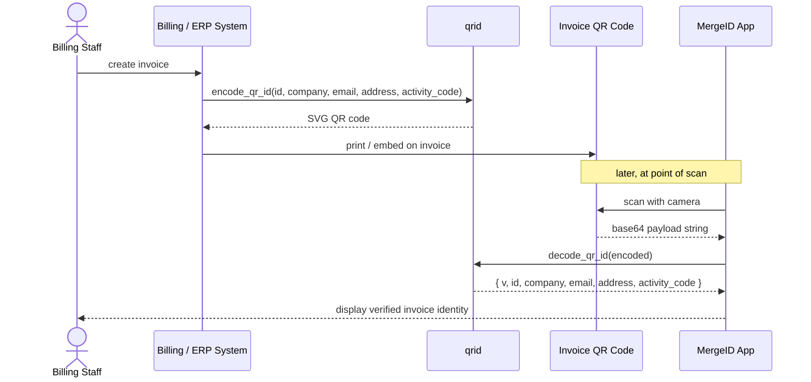

# qrid — Python

Decode and encode **MergeID electronic invoice QR codes**.

Python port of [`qrid/codec`](https://packagist.org/packages/qrid/codec) (PHP). All three implementations (PHP, Node.js, Python) share the same payload format and function signatures, so QR codes generated by any one of them scan correctly in the others.

## Typical usage flow



## Installation

```bash
# Decode only (no extra dependencies)
pip install qrid

# Decode + encode SVG
pip install 'qrid[encode]'
```

## Usage

### Decode

```python
from qrid import decode_qr_id

# `encoded` is the raw string value scanned from a MergeID QR code
payload = decode_qr_id(encoded)

print(payload["v"])             # Payload schema version (int, currently 1)
print(payload["id"])            # Tax or company ID              (e.g. "3101679980")
print(payload["company"])       # Company legal name
print(payload["email"])         # Billing e-mail address
print(payload["address"])       # Physical address
print(payload["activity_code"]) # Installation / activity code (e.g. "ACT-001"), or "" if blank
```

`decode_qr_id` strips surrounding whitespace before decoding, so strings
copied with accidental padding are handled transparently.

**Exceptions raised:**

| Exception | Cause |
| --- | --- |
| `ValueError` | Input is not valid base64 |
| `json.JSONDecodeError` | Decoded bytes are not valid JSON |

```python
import json
from qrid import decode_qr_id

try:
    payload = decode_qr_id(raw)
except ValueError:
    # QR data was not base64
    ...
except json.JSONDecodeError:
    # QR data decoded but was not the expected JSON structure
    ...
```

### Encode (requires `qrid[encode]`)

```python
from qrid import encode_qr_id

svg = encode_qr_id(
    id="3101679980",
    company="Acme Corp S.A.",
    email="billing@acme.example",
    address="123 Main St, San José, Costa Rica",
    activity_code="ACT-001",
)

# Write to a file
with open("invoice_qr.svg", "w") as f:
    f.write(svg)

# Or serve directly
# Content-Type: image/svg+xml
```

`activity_code` is optional and defaults to `""` (blank). A blank activity code signals a
consuming system to generate an electronic ticket instead of using an activity code.

**Exceptions raised:**

| Exception | Cause |
| --- | --- |
| `ImportError` | `segno` is not installed (`pip install 'qrid[encode]'`) |

## Payload format

The QR code data is a UTF-8 JSON object encoded as standard base64 (no line-breaks):

```json
{
  "v": 1,
  "id": "3101679980",
  "company": "Acme Corp S.A.",
  "email": "billing@acme.example",
  "address": "123 Main St, San José, Costa Rica",
  "activity_code": "ACT-001"
}
```

| Field | Type | Description |
| --- | --- | --- |
| `v` | `int` | Payload schema version. Currently always `1`. |
| `id` | `str` | Tax / company registration ID. |
| `company` | `str` | Legal company name (UTF-8, including accented characters). |
| `email` | `str` | Primary billing or contact e-mail address. |
| `address` | `str` | Physical address of the company. |
| `activity_code` | `str` | Installation or activity code that links the QR to an internal record. May be blank (`""`), which signals a consuming system to generate an electronic ticket instead. |

## Requirements

| Dependency | Version | Required for |
| --- | --- | --- |
| Python | `>= 3.9` | Always |
| `segno` | `>= 1.6` | `encode_qr_id()` only |

## Running tests

```bash
pip install 'qrid[dev]'
pytest
```

## Publishing

Releases to PyPI are fully automated — there is no manual `twine upload` step:

1. Bump `version` in `pyproject.toml` and merge to `main`.
2. [`release.yml`](.github/workflows/release.yml) runs on every push to `main`. It reads the version from `pyproject.toml`; if no `vX.Y.Z` tag already exists for it, it runs the test suite and creates that tag plus a GitHub Release.
3. In that same run, `release.yml` calls [`publish.yml`](.github/workflows/publish.yml) as a reusable workflow, which re-runs the tests, builds the sdist/wheel, and uploads to PyPI using [Trusted Publishing (OIDC)](https://docs.pypi.org/trusted-publishers/) — no stored API token.

`publish.yml` is invoked directly as a job (`workflow_call`) rather than relying on the `release: published` event, because releases created with the Actions-internal `GITHUB_TOKEN` do not trigger other workflows via events (GitHub's anti-recursion guard). `publish.yml` still also accepts `release: published` (for a release cut by hand, e.g. from the GitHub UI) and `workflow_dispatch` (manual re-run) as a fallback.

Pushes to `main` that don't change the version are a no-op for `release.yml` (the tag already exists), so unrelated commits (docs, CI tweaks) don't trigger a release.

**One-time PyPI setup** (already done for this project, documented here for reference): add a pending trusted publisher at [pypi.org/manage/account/publishing](https://pypi.org/manage/account/publishing/) with owner `Quality-XP-Development-SESSA`, repository `qrid-python`, workflow filename `publish.yml`, and environment name `pypi`; the same `pypi` environment must exist under the repo's GitHub Settings → Environments.

## License

MIT
